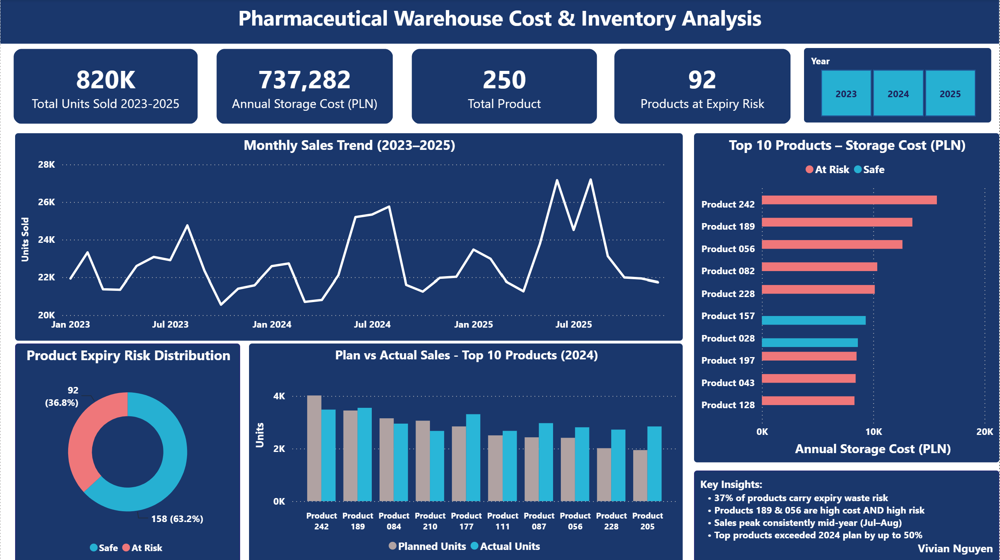

# 🏥 Pharmaceutical Warehouse Cost & Inventory Analysis

**Tools:** Python (Pandas, NumPy, Matplotlib, Seaborn) · Power BI · SQL  
**Dataset:** Fresenius Kabi Polska — Real-world pharmaceutical warehouse data via [Kaggle](https://www.kaggle.com/datasets/kacperjarosik1/warehouse-cost-optimization-pharmaceutical-company/data)  
**Author:** Vivian Nguyen · [LinkedIn](https://www.linkedin.com/in/vivian-nguyen-data) · Macquarie University 2025

---

## 📌 Project Overview

This project analyses 36 months of warehouse operations data (Jan 2023 – Dec 2025) for a hospital pharmaceutical company to identify cost drivers, inventory inefficiencies, and demand patterns — and produce actionable business recommendations.

The dataset originates from a real-world business challenge presented by Fresenius Kabi Polska, a manufacturer and distributor of medicinal products to the hospital healthcare segment.

---

## 📊 Dashboard Preview



---

## 🎯 Business Questions Answered

1. What are the overall sales trends and seasonal demand patterns across 36 months?
2. Which products are most expensive to store — and are they also high risk?
3. What percentage of products carry expiry waste risk?
4. How accurate is the current financial planning process vs actual sales?
5. What operational changes would most reduce costs and inventory risk?

---

## 🔍 Key Findings

| Finding | Detail |
|---|---|
| 📦 Total units sold | 820,000+ units across 36 months (250 products) |
| 💰 Annual storage cost | PLN 737,282 across the full portfolio |
| ⚠️ Products at expiry risk | 92 out of 250 products (36.8%) carry above-average expiry waste risk |
| ✅ Stockout risk | Zero products below safety stock threshold — supply continuity is strong |
| 📈 Seasonal pattern | Sales consistently peak mid-year (Jul–Aug) across all three years |
| 📋 Planning accuracy | Top products exceeded 2024 financial plan by up to 50% |

### Critical Double-Risk Finding
**Products 189 and 056** appear in both the Top 10 highest storage cost list AND the high expiry risk category — making them priority candidates for immediate inventory policy review. High storage cost combined with expiry risk means these products represent disproportionate financial exposure.

---

## 💡 Business Recommendations

**1. Prioritise expiry waste reduction — highest urgency**
37% of products carry above-average expiry waste risk. For hospital pharmaceuticals, expired product represents both financial waste and patient safety risk. Implementing demand-driven reorder quantities — particularly for short shelf-life products — would directly reduce this exposure.

**2. Address double-risk products immediately**
Products 189 and 056 are simultaneously expensive to store and at elevated expiry risk. A targeted review of order quantities and reorder timing for these products would deliver the highest return on inventory optimisation effort.

**3. Leverage mid-year demand patterns in production planning**
Sales consistently peak in July–August across all three years. Incorporating this seasonality into production schedules would improve stock availability during peak periods while reducing holding costs during low-demand months (January–February).

**4. Replace manual forecasting with data-driven planning**
Top-performing products exceeded their 2024 financial plan by up to 50%, suggesting the current manual forecasting process consistently underestimates demand. Integrating 36 months of historical sales trends and seasonality into planning models would improve accuracy and reduce both over-stocking and stockout risk.

---

## 🛠️ Technical Approach

### Data Pipeline
```
4 Raw CSV Files (Kaggle)
        ↓
Python: Data cleaning, reshaping wide→long format, EDA
        ↓
9,000 sales records + 9,000 stock records (post-reshape)
        ↓
7 analytical charts (Matplotlib/Seaborn)
        ↓
5 clean export tables → Power BI
        ↓
Interactive dashboard with year slicer
```

### Key Python Techniques
- **Wide-to-long reshaping** using `pd.melt()` to convert monthly columns into rows for analysis
- **Multi-table merging** across 4 data sources using `pd.merge()` on ProductID
- **Risk scoring** — custom waste risk score calculated as `avg_stock / shelf_life_months`
- **Variance analysis** — actual vs planned sales comparison across 2023–2025
- **Storage cost modelling** — `avg_monthly_stock × storage_cost_per_unit` annualised

### Power BI Features
- Interactive **year slicer** (2023 / 2024 / 2025) filtering all visuals simultaneously
- **Risk category color coding** — red (At Risk) vs teal (Safe) consistent across all charts
- **DAX measure** for expiry risk count using `COUNTROWS(FILTER())` with dynamic average threshold
- **Calculated column** `Risk_Category` using `IF()` DAX logic

---

## 📁 Repository Structure

```
pharma-warehouse-analysis/
├── pharma_warehouse_analysis.ipynb   # Python analysis notebook
├── pharma_warehouse_analysis.pbix    # Power BI dashboard file
├── dashboard_screenshot.png          # Dashboard preview image
├── export_monthly_sales.csv          # Clean monthly sales data (long format)
├── export_monthly_stock.csv          # Clean monthly stock levels (long format)
├── export_product_cost_summary.csv   # Product storage cost analysis
├── export_variance_summary.csv       # Plan vs actual variance by product/year
├── export_risk_summary.csv           # Inventory risk scores by product
└── README.md                         # This file
```

---

## 🚀 How to Run

**Python analysis:**
```bash
# Install dependencies
pip install pandas numpy matplotlib seaborn

# Open Jupyter Notebook
jupyter notebook pharma_warehouse_analysis.ipynb
```

**Power BI dashboard:**
1. Open `pharma_warehouse_analysis.pbix` in Power BI Desktop
2. If prompted, update data source paths to your local folder
3. Click Refresh to reload data

**Data source:**
Download the original dataset from [Kaggle](https://www.kaggle.com/datasets/kacperjarosik1/warehouse-cost-optimization-pharmaceutical-company/data) and place the 4 CSV files in the same folder as the notebook.

---

## 📚 Skills Demonstrated

`Python` `Pandas` `NumPy` `Matplotlib` `Seaborn` `Power BI` `DAX` `Data Cleaning` `EDA` `Data Visualisation` `Business Analysis` `Inventory Analysis` `KPI Reporting` `Data Storytelling`

---

*Dataset source: Fresenius Kabi Polska via Kaggle — anonymised real-world pharmaceutical warehouse data presented as part of an academic business challenge.*
